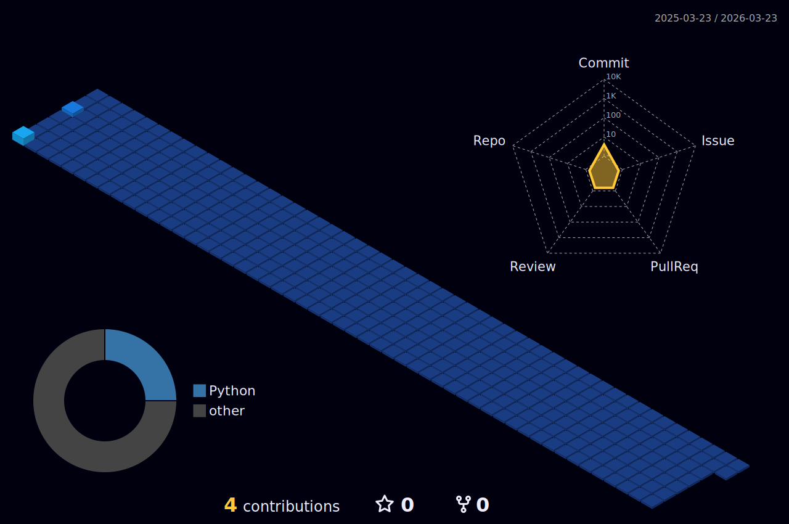

 

<!-- ABOUT ME -->
 

---

 <a href="https://github.com/thttp" > 
  <a href="https://github.com/thttp">
 

</a>  

  - 📚 I’m currently studying Analysis and Systems Development and Digital Security at UNINASSAU. I've been a technology enthusiast since I was a child, I've always been fascinated with solving problems logically, both in games and in everyday life.

  - 🎓I am looking for my first job opportunity. My dream is to one day work with Ciber Security, but I'm open to new challenges. I recently completed the CS50 course, where I acquired skills in C#, Full Stack Web Development and became capable of creating technological solutions.

<!-- DROPDOWN -->

  
 👨‍💻 More about me 

  
  - 💬 I am 18 years old, currently living in Brazil. I have fluency in English and have experience with SQL, Python, C#, and Machine Learning.

  - ⚡ I enjoy reading, whether it's a good book, manga, or comics, as well as watching movies and playing games! I believe that our personal interests contribute to a more refined perception of things and problem-solving. \o/

 
 

<!-- CONTACT -->
𝙲𝚘𝚗𝚝𝚊𝚌𝚝 𝙼𝚎:

 
  

  

---

<!-- SKILLS -->
<h3 align="center">
 𝚂 𝙺 𝙸 𝙻 𝙻 𝚂
</h3>
 

  
  
  
  
  
  
 
    
 <!-- DROPDOWN -->
 

  
 Learning Skills 🚀 
  
   
  
 

---

<!-- STATS -->
<h3 align="center">
 𝚂 𝚃 𝙰 𝚃 𝚂
</h3>
<a href="https://github.com/thttp">
 

  
</a>

   

<!-- STATISTICS -->
  

 <!-- NIGHT VIEW -->
   

<!-- TROPHY -->

<a href="https://github.com/thttp">    

---

   
 <a href="https://github.com/thttp"> 
 

<a href="https://github.com/thttp"> 
